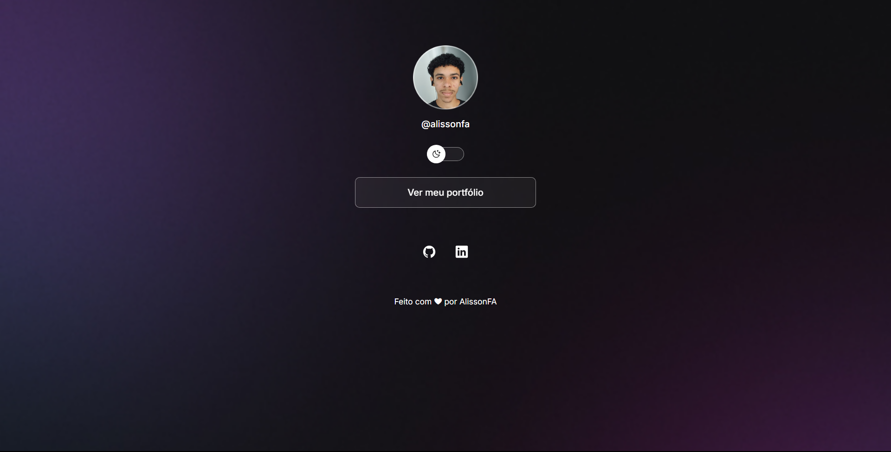

<h1 align="center"> DevLinks | Agregador de Links Personalizado </h1>

  Um agregador de links responsivo, construído com HTML, CSS e JavaScript.
   
  Desenvolvido para ser semelhante a ferramentas como o Linktree.

  <a href="#-tecnologias">Tecnologias</a>&nbsp;&nbsp;&nbsp;|&nbsp;&nbsp;&nbsp;
  <a href="#-projeto">O Projeto</a>&nbsp;&nbsp;&nbsp;|&nbsp;&nbsp;&nbsp;
  <a href="#-layout">Layout</a>&nbsp;&nbsp;&nbsp;|&nbsp;&nbsp;&nbsp;
  <a href="#-licença">Licença</a>

  
  

## 🚀 Tecnologias

Este projeto foi desenvolvido com foco em ser semelhante a ferramentas como o Linktree e em ser leve, o que significa que mesmo em redes móveis 3G/4G o carregamento será rápido.

- **HTML5:** Estrutura semântica para melhor SEO e Acessibilidade.
- **CSS3:** Uso avançado de estilização incluindo:
  - Variáveis CSS (`:root`) para temas dinâmicos e manutenção fácil.
  - Flexbox para layouts fluidos e alinhamentos precisos.
  - Box Model & Posicionamento.
  - Media Queries para adaptação total a qualquer tipo de dispositivo.
  - Animação.
- **JavaScript (ES6+):** Manipulação da DOM para a lógica do "Theme Switcher" (Troca de Tema Claro/Escuro).
- **Git & GitHub:** Versionamento de código e deploy via GitHub Pages.
- **Figma**

## 💻 O Projeto

O **DevLinks** é um hub central para portfólio e redes sociais. Esta solução oferece:

1.  **Identidade Visual Total:** Totalmente adaptável para as cores e marca usando Variáveis CSS.
2.  **Theme Switcher:** Inclui alternância entre Modo Claro e Escuro, com lógica em JS para trocar avatar e ícones.
3.  **Performance:** Ausência de recursos desnecessários.
4.  **Acessibilidade** Inclui alts de imagens totalmente adaptáveis para uma maior inclusão.

## 🔖 Layout

Você pode visualizar o layout do projeto atráves [DESSE LINK](https://www.figma.com/community/file/1187422022288947321).
Você pode visualizar o projeto rodando [AQUI](https://alissonfa.github.io/DevLinks/)

## 📝 Licença

Esse projeto está sob a licença MIT.

---

Feito com ♥ por [AlissonFA](https://www.linkedin.com/in/alissonfa/)